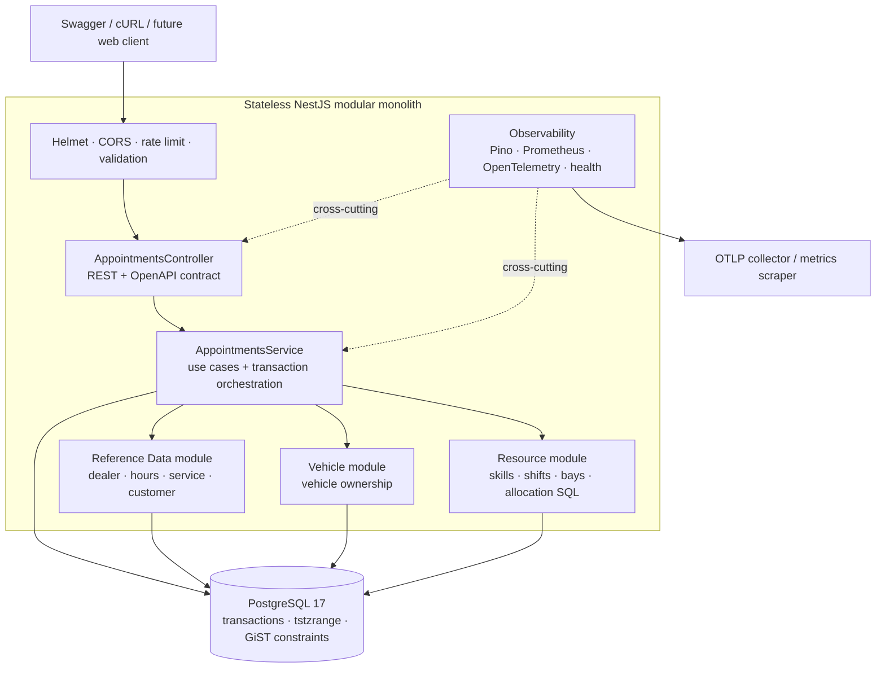
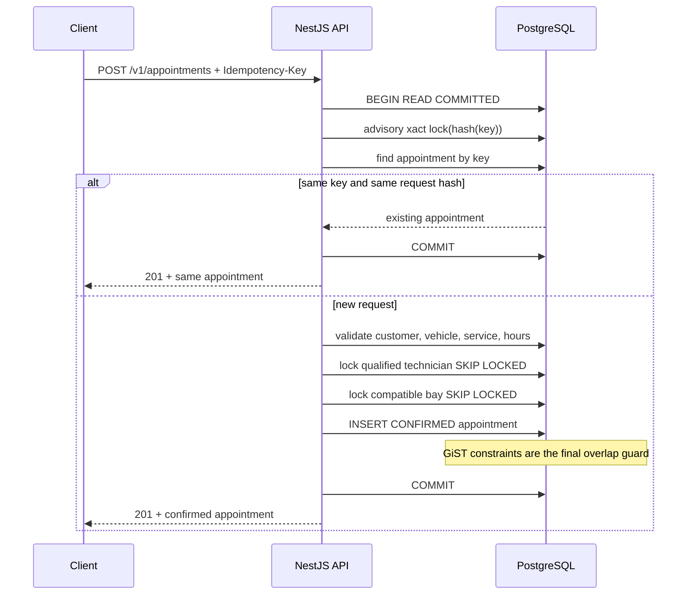

# Unified Service Scheduler - Brief System Design

> **Scenario:** Keyloop Technical Assessment - Scenario A  
> **Scope:** Backend service; Swagger/OpenAPI and cURL act as client stubs  
> **Document Version:** 1.0 - 2026-08-31  
> **Source of Truth:** Business requirements in the problem specification and the current state of the working tree, not just commit `HEAD`

## 1. Executive Summary

The Unified Service Scheduler replaces manual booking workflows with an API capable of:

1. Simultaneously verifying both a qualified technician and a compatible service bay across the entire service duration;
2. Confirming both resources within the same database transaction;
3. Persisting an `Appointment` record linking customer, vehicle, dealership, service type, technician, and service bay;
4. Safely handling retries and concurrent booking attempts without double-booking or creating duplicate records.

The chosen solution is a **stateless NestJS modular monolith with PostgreSQL as the single consistency boundary**. Bookings execute inside short `READ COMMITTED` transactions using advisory locks for idempotency, `FOR UPDATE ... SKIP LOCKED` row locks for resource allocation, and partial GiST exclusion constraints as the ultimate safety net against overlapping schedules.

This design aligns with the low-to-medium contention profile expected per dealership: it prioritizes correctness, immediate synchronous confirmation, and operational simplicity over microservices, distributed locks, or message queues on the critical path.

## 2. Requirements Baseline and Guidance Boundaries

The assessment specification is treated as the **problem specification**, not a rigid workflow execution script. From Scenario A, this design derives three primary acceptance criteria:

- The user requests an appointment by specifying vehicle, service type, dealership, and desired start time;
- The system checks real-time availability of both a qualified technician and a compatible service bay throughout the service duration;
- Upon success, the system saves the confirmed appointment linking all associated entities.

The specification also requires an architecture diagram, component roles, data flow, technology justifications, observability strategy, and a GenAI collaboration narrative. These items define the deliverable requirements. All practical technical decisions have been cross-checked against actual code, migrations, tests, and ADRs in this repository.

## 3. Problem and User Value

### 3.1 Problem Statement

Manual and uncoordinated booking workflows typically suffer from four major failure modes:

- Accepting appointments when no technician with required skills is available;
- Allocating an incorrect service bay type or a bay under scheduled maintenance;
- Double-booking technicians or bays under concurrent customer requests;
- Creating duplicate appointments when a client encounters a network timeout and retries.

### 3.2 Solution Value

| User Need | Solution Mechanism | Outcome |
| --- | --- | --- |
| Check slot availability | `POST /v1/availability/check` verifies skills, shifts, blockouts, bay types, business hours, and overlaps | Returns a snapshot along with server-calculated end time |
| Book without double-booking | Transactions, row locks, and exclusion constraints | Only valid, non-conflicting capacity is committed |
| Safe retries without duplicates | `Idempotency-Key`, SHA-256 request payload hash, and transaction-level advisory locks | Same key & payload returns existing appointment; payload mismatches are rejected |
| Accurate timezone handling & adjacent bookings | IANA timezones, `timestamptz`, and half-open intervals `[start, end)` | DST-safe; a booking ending at 10:00 does not block one starting at 10:00 |
| Confirmed proof of booking | Persistent PostgreSQL record with foreign keys and status lifecycle | Fully linked appointment tying together customer, vehicle, technician, and bay |

## 4. Assumptions, Scope, and Non-Goals

### 4.1 Assumptions

1. Each appointment requires exactly one technician and one service bay.
2. The service type defines the duration, required bay type, and required skills; clients cannot supply arbitrary `endsAt` timestamps.
3. A technician must possess all required skills, have a scheduled shift covering the entire duration, and have no conflicting blockouts.
4. Technicians and service bays must belong to the dealership specified in the request.
5. Statuses `CONFIRMED` and `IN_PROGRESS` hold resource capacity; `CANCELLED` and `COMPLETED` release capacity.
6. Availability checks are point-in-time snapshots, not reservations. Booking always re-evaluates capacity inside a transaction.
7. Each dealership operates in an IANA timezone; API timestamps must include `Z` or UTC offset.
8. The primary PostgreSQL instance is the single source of truth; active-active multi-region writes are out of scope.

### 4.2 In Scope

- Real-time availability checking;
- Idempotent and atomic appointment booking;
- Fetching appointment details by ID;
- Idempotent cancellation and capacity release;
- PostgreSQL persistence, OpenAPI contract, health endpoints, structured logs, Prometheus metrics, and optional distributed traces;
- Unit, integration, E2E, and concurrency test suites.

### 4.3 Current Non-Goals

- Full customer-facing frontend, payment gateways, notifications, waitlists, and temporary reservation holds;
- Recurring appointments or multi-stage workshop repair jobs;
- Public administrative CRUD for technicians, shifts, bays, customers, or service catalogs;
- Production identity provider / OAuth2 integration;
- Event sourcing, Kubernetes orchestration, or asynchronous queues deciding booking validity.

## 5. High-Level Architecture



The architecture employs **domain-driven design (DDD) boundaries within a single deployable unit** following **Clean Architecture-light** principles:

- Controllers handle HTTP transport contracts, payload validation, and status mapping;
- Application services own use cases, business policies, and transaction orchestration;
- Domain types define statuses, intervals, and business error codes;
- Repositories act as domain query and resource allocation ports;
- Migrations manage database schema evolution; `synchronize: false` prevents the ORM from auto-modifying the database.

## 6. Component Roles

| Component | Role | Codebase Evidence |
| --- | --- | --- |
| `AppointmentsController` | Exposes 4 REST operations, enforces UUID idempotency headers, produces OpenAPI documentation | [`appointments.controller.ts`](../src/modules/appointments/appointments.controller.ts) |
| `AppointmentsService` | Orchestrates availability checks, booking transactions, idempotency handling, lifecycle transitions, and error mapping | [`appointments.service.ts`](../src/modules/appointments/application/appointments.service.ts) |
| Resource Module | Selects available technicians and bays matching skills, shifts, bay types, blockouts, and overlaps; locks in strict technician-then-bay order | [`resource-allocation.repository.ts`](../src/modules/resources/repositories/resource-allocation.repository.ts) |
| Vehicle Module | Validates vehicle existence and customer ownership | [`vehicle.repository.ts`](../src/modules/vehicles/repositories/vehicle.repository.ts) |
| Reference Data Module | Provides dealership profiles, timezones, operating hours, customer records, and service definitions | [`reference-data.repository.ts`](../src/modules/reference-data/repositories/reference-data.repository.ts) |
| PostgreSQL Database | Enforces persistence, foreign key integrity, idempotency uniqueness, and temporal exclusion invariants | [`1724803200000-initial-schema.ts`](../src/shared/database/migrations/1724803200000-initial-schema.ts) |
| Shared HTTP Layer | Enforces strict DTO validation, standardized error envelopes, Helmet headers, CORS policies, and rate limits | [`main.ts`](../src/main.ts) |
| Observability Layer | Emits structured JSON logs, low-cardinality metrics, OpenTelemetry spans, and liveness/readiness probes | [`observability`](../src/shared/observability) & [`health`](../src/modules/health) |

## 7. Data Model and Critical Invariants

The data model is organized into three primary layers:

- **Identity & Reference Data:** `dealerships`, `customers`, `vehicles`, `service_types`, `skills`;
- **Resource Capacity:** `technicians`, `technician_skills`, `technician_shifts`, `technician_unavailability`, `service_bays`, `service_bay_unavailability`;
- **Transactional Records:** `appointments`.

The `appointments` table stores `starts_at` and `ends_at` as `timestamptz` along with a generated column:

```sql
tstzrange(starts_at, ends_at, '[)')
```

Two partial GiST exclusion constraints reject temporal overlaps across:

- `(dealership_id, technician_id, scheduled_period)`;
- `(dealership_id, service_bay_id, scheduled_period)`;

when appointment status is `CONFIRMED` or `IN_PROGRESS`. In addition, composite foreign keys prevent associating a vehicle with the wrong customer, or a technician/bay with the wrong dealership. Database constraint error `23P01` is translated into domain-level `409 SLOT_CONFLICT`.

## 8. Data Flow

### 8.1 Availability Check - Read-Only Snapshot

1. Validates UUIDs and timezone-aware future start timestamps.
2. Loads vehicle, active dealership, operating timezone, business hours, and service definition.
3. Server computes `endsAt` based on service catalog duration.
4. Verifies that the entire scheduled period falls within local dealership operating hours.
5. Queries active technicians holding all required skills, on active shift for the period, with no blockouts and no overlapping appointments.
6. Queries active service bays matching the required bay type, with no blockouts and no overlapping appointments.
7. Returns `available: true` with calculated interval or `available: false` with a stable reason code.

*Note: This endpoint performs no locking and reserves no capacity. Clients may still receive `409 SLOT_CONFLICT` upon booking if capacity is claimed between the check and submission.*

### 8.2 Atomic Booking



The multi-layered concurrency control strategy works as follows:

- **Advisory Lock:** Serializes concurrent requests sharing the exact same idempotency key, without bottlenecking distinct booking requests.
- **Request Hash:** Differentiates safe idempotent retries from improper key reuse with altered payloads.
- **Row Locks + `SKIP LOCKED`:** Coordinates resource selection across multiple API instances and eliminates lock contention deadlocks; locks are acquired strictly in technician-then-bay order.
- **Overlap Predicates:** Eliminates unavailable candidates early and yields readable domain errors.
- **Exclusion Constraints:** Acts as the unbypassable source of truth should any race condition slip through read-level checks.

### 8.3 Cancellation

The API locks the appointment record, transitions status from `CONFIRMED` to `CANCELLED`, and retrieves the updated row within the same transaction. Repeated cancellation requests return the existing cancelled state idempotently. Because GiST exclusion constraints ignore `CANCELLED` records, the capacity is instantly released for future bookings without deleting audit history.

## 9. Evaluated Solutions & Trade-off Analysis

The core selection criteria were: zero double-booking under concurrent multi-instance traffic, immediate synchronous confirmation, safe network retry handling, and low operational overhead for low-to-medium dealership contention.

| Option | Concurrency Correctness | Confirmation UX | Operational Complexity | Strengths | Reason for Selection / Rejection |
| --- | --- | --- | --- | --- | --- |
| **A. Modular Monolith + PostgreSQL Transactions/Locks/Exclusion** | **Strong; invariants enforced at DB** | Immediate synchronous response | Low to Medium | Minimal moving parts, easy local/CI testing, horizontally scalable API | **Selected.** Fully satisfies all hard constraints using a single consistency boundary. |
| B. Application-Only Availability Check then Insert | Weak; vulnerable to TOCTOU race conditions | Fast | Low | Highly portable, simple code | Rejected because two API instances can simultaneously see a slot as free and insert duplicate bookings. |
| C. Redis Distributed Lock for Resource/Time Slots | Moderate, if failure modes are handled; DB still needs guards | Synchronous | Medium to High | Decreases database lock contention in high-throughput systems | Rejected because it introduces a second consistency tier, lock expiry hazards, and split-brain states without measurable load justification. |
| D. Asynchronous Message Queue per Dealership/Resource | Moderate, if partitioning and deduplication are correct; DB still needs guards | Asynchronous or requires long polling | High | Absorbs traffic spikes, strict ordering control | Rejected on the booking path because it harms synchronous UX and introduces broker/worker/poison-message failure modes. Queues are better suited for post-commit side effects. |
| E. Microservices + Saga / Resource Reservation Service | Potentially strong, but requires clear single allocation ownership | Multi-hop synchronous or eventual consistency | Very High | Independent service deployments and scaling | Rejected because Scenario A lacks organizational or domain scale boundaries requiring it; sagas complicate atomic multi-resource allocation. |

### 9.1 Why Solution A Won

1. **Correctness at the Data Boundary:** Every API replica and any future background worker is governed by the same unbypassable database constraints.
2. **Natural User Journey:** An HTTP `201 Created` status maps directly to a committed database transaction; no polling or asynchronous job tracking is required.
3. **Low Operational Burden:** Consists of stateless API containers and a PostgreSQL database—no distributed brokers, Redis lock managers, or saga orchestrators.
4. **Clean Evolution Path:** Domain modules already maintain strict boundaries; post-commit events can be emitted via transactional outbox; `dealership_id` serves as a natural shard key if database write throughput ever becomes a bottleneck.

### 9.2 Accepted Trade-offs

- Direct dependency on PostgreSQL-specific features (`tstzrange`, GiST index extensions, `SKIP LOCKED`);
- Peak throughput is constrained by the primary database write capacity, connection pool size, and lock durations;
- `SKIP LOCKED` may momentarily report capacity unavailable if a concurrent transaction is actively evaluating a candidate;
- Integration and concurrency test suites require a real PostgreSQL instance rather than in-memory SQLite mocks.

These trade-offs are deliberately accepted: trading theoretical database engine portability for absolute booking correctness and operational simplicity.

## 10. Technology Choices and Justification

| Technology / Tool | Justification |
| --- | --- |
| Node.js 22 + TypeScript 5 | High-performance non-blocking runtime for I/O-heavy workloads; strong static typing enforces compile-time contract safety. |
| NestJS 11 | Out-of-the-box modular architecture, dependency injection, declarative validation pipes, and automated OpenAPI contract generation. |
| PostgreSQL 17 | Robust ACID transactions, advisory locks, row-level locking, native range types, and GiST exclusion constraints solve temporal scheduling natively. |
| TypeORM | Manages database connection lifecycle, entity mappings, and migration tracking; raw parameterized SQL is utilized in resource allocation for full PostgreSQL feature support. |
| Luxon | Reliable IANA timezone conversions, daylight saving time (DST) calculations, and business hours verification over native `Date`. |
| Swagger / OpenAPI | Fulfills backend-choice requirements and provides an interactive client contract and testing harness without requiring a custom frontend. |
| Pino / `nestjs-pino` | High-throughput structured JSON logging with request correlation IDs and automatic PII/credential redaction. |
| Prometheus `prom-client` | Standardized metrics exposition (`/metrics`) with low-cardinality labels tailored for latency histograms and alert SLOs. |
| OpenTelemetry | Provides non-intrusive distributed tracing via OTLP without making the collector a hard runtime dependency. |
| Jest + Supertest + PostgreSQL | Comprehensive testing pyramid spanning unit domain logic, HTTP API contracts, database migration constraints, and concurrent allocation matrices. |
| Docker Compose + Explicit Migrations | Ensures reproducible local and CI environments; decouples schema deployment from API server bootup. |

## 11. Reliability, Scalability, Performance, and Security

### 11.1 Reliability

- Transaction rollback automatically releases all row and advisory locks if a process or network failure occurs prior to commit;
- Idempotency keys allow clients to safely retry identical requests following network timeouts;
- Liveness probes are decoupled from bounded database readiness health checks;
- Migrations execute as a dedicated single-execution deployment step, never concurrently across API replicas;
- Production deployments should utilize AWS RDS Multi-AZ or equivalent, automated snapshots, and Point-In-Time Recovery (PITR).

### 11.2 Scalability and Performance

- Stateless API instances scale horizontally behind a Layer 7 load balancer;
- Queries are strictly scoped by `dealership_id` and backed by composite B-tree and GiST indexes;
- Short transaction lifetimes and deterministic lock acquisition order keep pool saturation low (default max 10 connections per instance);
- Authoritative availability checks read directly from the database; caching is reserved for static reference catalogs and operating schedules;
- Scaling mechanisms such as RDS Proxy, read replicas for analytics, or tenant sharding by `dealership_id` should only be introduced when telemetry demonstrates necessity.

### 11.3 Security

- Layered protection includes Helmet security headers, CORS allowlisting, global rate limiting, strict DTO parameter whitelisting, parameterized SQL queries, generic internal error masks, and log masking.
- *Production Readiness Note:* Current implementation lacks a production identity provider (IdP). Production rollout requires OIDC authentication, dealership-level RBAC/ABAC authorization, least-privilege database user roles, TLS in transit, automated secrets rotation, and audit trails.

## 12. Observability Strategy

| Signal | Implementation | Operational Purpose |
| --- | --- | --- |
| **Logs** | Structured JSON via Pino containing service name, environment, correlation request ID, trace ID, route, status code, and domain error codes; redaction for tokens/PII. | Trace individual request journeys and correlate business errors with traces. |
| **Metrics** | `/metrics` endpoint exposing request counters, active requests, latency histograms, process stats, and booking outcome counters (`attempted`, `confirmed`, `conflict`, `unavailable`). | Power dashboard visualization and alert on error rates, p95/p99 latency spikes, and capacity saturation. |
| **Traces** | OpenTelemetry auto-instrumentation and custom semantic spans for availability checks, booking transactions, and database queries (exported via OTLP). | Pinpoint latency bottlenecks across HTTP, application logic, and PostgreSQL layers. |
| **Health** | Decoupled `/health/live` and `/health/ready` with a 1-second bounded database ping. | Orchestrator can safely restart failing containers while routing traffic only to fully initialized nodes. |
| **Errors** | Standardized error response envelope with stable error codes, correlation IDs, and optional trace IDs. | Enables deterministic client error handling while shielding internal database specifics. |

Production alert rules should monitor 5xx error rates, p95/p99 booking latencies, readiness check failures, connection pool saturation, lock wait durations, deadlocks, and exclusion constraint conflict spikes. Metric route labels use parameterized route templates rather than raw UUIDs to prevent cardinality explosion.

## 13. Verification Strategy and Evidence

| Layer | Objective |
| --- | --- |
| **Unit Tests** | Verify business hours across timezones, daylight saving transitions, day boundaries, and canonical request payload hashing. |
| **Integration Tests** | Validate GiST exclusion constraints, adjacent appointment boundaries, cancelled appointment behavior, composite foreign keys, and PostgreSQL error `23P01` mapping. |
| **E2E Tests** | Validate full HTTP flows: availability check, booking, retrieving, cancelling, rebooking, idempotency replay, validation failures, and OpenAPI spec compliance. |
| **Concurrency Tests** | Validate 1x1, 2x1, 1x2, and 2x2 technician/bay contention matrices, 20-request burst loads, same-key request coalescing, and cross-dealership isolation. |
| **Static & Build** | ESLint compliance, strict TypeScript typechecking, NestJS production build compilation, and OpenAPI specification consistency. |

In the verification run for this assessment, `pnpm test:unit` completed with **6/6 passing tests**, while `pnpm lint` and `pnpm typecheck` passed cleanly. Full PostgreSQL integration, E2E, and concurrency test suites are codified in the repository and CI workflow; however, because the local Docker engine was offline during local verification, these containerized suites were not re-executed locally, and no unverified claims of local container execution are made.

## 14. GenAI Collaboration in the Design Phase

As documented in [`AI_COLLABORATION_LOG.md`](AI_COLLABORATION_LOG.md), GenAI was leveraged as an implementation accelerator and adversarial reviewer, with human architectural ownership retaining final authority over domain invariants, scope, and verification gates.

The documented collaboration workflow included:

1. Beginning with a structured implementation plan and conducting an adversarial red-team pass to challenge core assumptions;
2. Partitioning non-overlapping implementation tasks between appointment core services, platform observability, PostgreSQL test harnesses, and architecture documentation;
3. Evaluating technical trade-offs (such as `tstzrange` vs `tsrange`, half-open vs inclusive intervals, and database-level invariants vs Redis locks or queue-based checks);
4. Enforcing verification against real PostgreSQL instances rather than in-memory SQLite mocks;
5. Refactoring code in response to empirical test evidence (e.g., updating appointment cancellation from raw `UPDATE ... RETURNING` to explicit `UPDATE` followed by transactional `SELECT`, and making `DATABASE_SSL` an explicit configuration for local Docker Compose);
6. Performing standards and spec compliance reviews to ensure proper repository port abstractions, OpenAPI DTO alignment, test isolation guards, concurrency test coverage, and low-cardinality telemetry.

*Governing Principle:* AI outputs are treated as working hypotheses; solutions are accepted only after validating against business requirements, potential failure modes, automated tests, and rigorous code reviews. No unsupported productivity or test coverage statistics are asserted.

## 15. Limitations and Evolution Roadmap

### P0 Requirements Prior to Production

- Implement OIDC authentication and dealership/tenant authorization guards across all read/write endpoints;
- Build administrative workflows and audit logs for managing technicians, shifts, blockout schedules, bays, and service catalogs;
- Conduct load and stress testing under realistic target concurrency to establish baseline Service Level Objectives (SLOs);
- Establish operational runbooks for database migrations, PITR backups, disaster recovery, failover procedures, and idempotency key retention policies.

### P1 Enhancements for Product Growth

- Add smart slot suggestion and search endpoints rather than single-timestamp point checks;
- Implement temporary capacity holds with short TTLs for multi-step customer checkout flows;
- Introduce a transactional outbox and event queue for post-commit side effects (e.g., customer notifications, CRM syncing, analytics);
- Model preparation/cleanup buffer times and multi-stage repair jobs as explicit scheduling intervals.

### Architectural Evolution Triggers

Transitioning to distributed microservices or external coordination should only occur upon concrete evidence: separate team ownership boundaries, strict data compliance isolation, unresolvable connection pool saturation, or long-running workflows requiring distributed sagas. Regardless of future evolution, a single service and database consistency boundary must retain final ownership over atomic resource allocation invariants.

## 16. Conclusion

The core technical challenge of this system is **atomic multi-resource scheduling under temporal constraints**. The defining architectural quality is not merely querying availability, but orchestrating a multi-tiered defense: lightweight snapshots for user experience, deterministic row locking for race prevention, database exclusion constraints for absolute correctness, and transactional idempotency for network resilience.

A modular monolith paired with PostgreSQL was selected because it decisively eliminates the greatest user risk—a confirmed booking with a double-booked technician or bay—with minimal operational complexity under the system's baseline assumptions. Distributed locks, message brokers, and microservices offer valid benefits at different scales, but add unnecessary points of failure for this domain workload without providing superior correctness guarantees.

## Appendix: Related Documentation

- [`README.md`](../README.md)
- [`SYSTEM_DESIGN.md`](SYSTEM_DESIGN.md)
- [`ADR 0001 - Modular Monolith`](adr/0001-modular-monolith.md)
- [`ADR 0002 - Database Coordination Over Message Queues`](adr/0002-database-locking-over-message-queue.md)
- [`ADR 0003 - tstzrange Exclusion Constraints`](adr/0003-tstzrange-exclusion-constraints.md)
- [`OpenAPI Contract`](../openapi/openapi.json)
- [`CI Workflow`](../.github/workflows/ci.yml)
