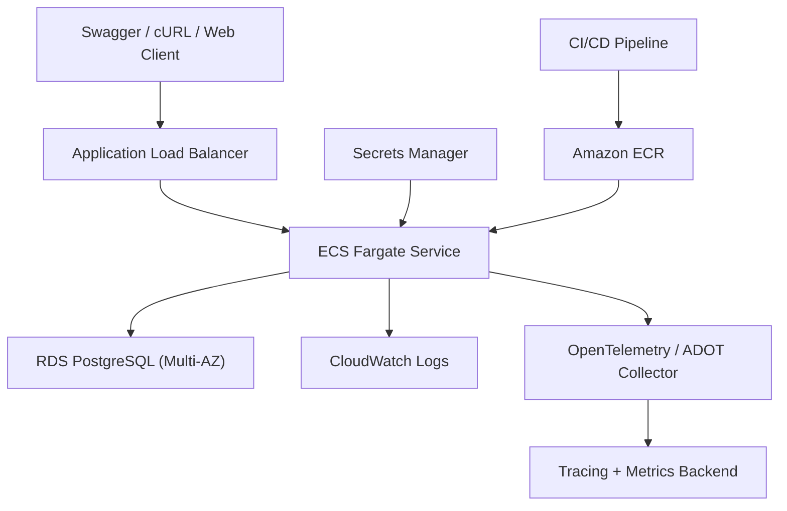

# Scenario A - Unified Service Scheduler: Detailed Implementation Plan

## 1. Architectural Decisions

### Scope of Implementation

Full implementation of the **backend service**:

- RESTful API built with NestJS and TypeScript.
- PostgreSQL as the single persistent database.
- TypeORM managing entities, repositories, and migrations.
- Swagger/OpenAPI, cURL, and automated test suites serving in place of a frontend client.
- Docker Compose for one-command local execution.
- System Design Document, README, AI Collaboration Narrative, and presentation video script.

### Chosen Architecture

- **Modular monolith**, avoiding microservices for this assessment scope.
- **Clean Architecture-light** combined with Command/Query Separation principles.
- Single PostgreSQL database with strictly isolated module and data ownership boundaries.
- Synchronously confirmed bookings within a single database transaction.
- GiST exclusion constraints as the ultimate database-level guard against double-booking.
- Row-level locking (`FOR UPDATE ... SKIP LOCKED`) for deterministic resource selection under concurrency.
- No caching of authoritative, decision-making availability data.
- No Message Queue on the critical synchronous booking path.

*Rationale:* Overall traffic may scale with the number of dealerships, but the **actual contention and collision domain is localized to the same technician, service bay, and time window within an individual dealership**. Therefore, database constraints solve the exact consistency boundary without the operational complexity of distributed systems.

---

## 2. Requirements Baseline vs. Solution Design Decisions

| Category | Item Description |
| --- | --- |
| Mandatory Scenario A Requirement | Accept appointment requests specifying vehicle, service type, dealership, and desired time |
| Mandatory Scenario A Requirement | Simultaneously verify real-time availability of a qualified technician and compatible service bay across the full service duration |
| Mandatory Scenario A Requirement | Persist an Appointment record linking customer, vehicle, technician, and service bay |
| Mandatory Assessment Deliverable | System Design Document featuring architecture diagrams, component roles, data flows, technology justification, observability strategy, and GenAI usage |
| Mandatory Deliverable (Backend Choice) | REST API, persistent database, client stub / cURL / OpenAPI harness |
| Mandatory Submission Artifact | Comprehensive README, AI Collaboration Narrative, and automated tests for core business logic |
| Mandatory Assessment Deliverable | 5–10 minute demonstration video |
| Solution Architectural Decision | NestJS, TypeScript, TypeORM, and PostgreSQL 17 |
| Solution Architectural Decision | Modular monolith with Clean Architecture-light domain boundaries |
| Solution Architectural Decision | PostgreSQL GiST exclusion constraints and deterministic row-level locking |
| Solution Architectural Decision | AWS ECS Fargate, ALB, and RDS Multi-AZ as the target production deployment topology |
| Non-Mandatory / Excluded Technology | Redis, Message Queues (Kafka/RabbitMQ), microservices, Kubernetes, event sourcing, active-active multi-region writes |

---

## 3. Assumption Register

These assumptions are explicitly established at the outset of the design:

1. **Low-to-Medium Contention Profile:** Defined as a low-to-medium volume of concurrent requests competing for the exact same technician or service bay at a specific dealership. Total system-wide throughput scales with the number of independent dealerships.

2. In the baseline MVP, each Appointment requires exactly:
   - One customer.
   - One vehicle.
   - One service type.
   - One dealership.
   - One technician.
   - One service bay.

3. Service duration is configured within the `service_type` catalog and calculated exclusively on the server. Clients cannot provide arbitrary `endsAt` timestamps or override service durations.

4. A technician must possess **all required skills** specified by the requested service type.

5. A service bay must belong to the requested dealership and match the bay type required by the service type.

6. The scheduled appointment period must fall entirely within:
   - The dealership's local operating business hours.
   - The assigned technician's active working shift.
   - The operational operating hours of the service bay.
   - Outside of any breaks, scheduled maintenance windows, or blockouts.

7. The availability check endpoint is a point-in-time snapshot. The booking API always re-evaluates capacity and allocates resources inside an atomic transaction.

8. All scheduling intervals adhere to the half-open range convention `[start, end)`: an appointment ending at 10:00 does not conflict with an appointment beginning at 10:00.

9. The baseline scope excludes temporary holds, waitlists, payment processing, customer notifications, recurring appointments, and multi-stage repair jobs.

10. Production authentication and authorization are modeled as an external OIDC/Cognito integration point; a mock identity system is not constructed merely for assessment demonstration.

### Critical Decision on Temporal Range Types

Use `tstzrange` instead of `tsrange`:

- The API accepts ISO-8601 timestamps containing timezone offsets.
- Each dealership operates within an IANA timezone (e.g., `Europe/London`).
- PostgreSQL persists normalized UTC instants.
- API responses return consistent UTC or offset-aware timestamps.

`tsrange` stores timestamps without timezones, making it prone to errors when expanding across multiple dealerships or regions observing Daylight Saving Time (DST). The underlying exclusion constraint mechanics remain identical.

---

## 4. Domain-Driven Design & Bounded Contexts

### Appointment Context

Ownership:

- Appointment aggregate and lifecycle state machine.
- Real-time availability checking.
- Atomic resource allocation orchestration.
- Idempotency handling and request hash verification.
- Cancellation and slot release rules.
- State transitions: `CONFIRMED`, `IN_PROGRESS`, `COMPLETED`, `CANCELLED`.

Primary Use Cases:

- `CheckAvailabilityQuery`
- `BookAppointmentCommand`
- `GetAppointmentQuery`
- `CancelAppointmentCommand`

Core Invariants:

- `endsAt > startsAt`.
- Service duration derived strictly from service catalog.
- Vehicle must belong to the requesting customer.
- All allocated resources must belong to the specified dealership.
- Technician possesses all required skills.
- Service bay matches the required bay type.
- Zero temporal overlap across technician and bay schedules.
- Confirmed appointments must link both a technician and a service bay.

### Vehicle Context

Ownership:

- `Customer` aggregate.
- `Vehicle` aggregate.
- Customer-vehicle ownership relationships.
- Vehicle Identification Number (VIN) and vehicle metadata.

*Boundary Rule:* The Appointment context references Vehicle and Customer IDs via application ports and never mutates Vehicle records directly.

### Resource Context

Ownership:

- `Technician` aggregate.
- `TechnicianSkill` associations.
- `TechnicianShift` working schedules.
- `ServiceBay` aggregate and bay classifications.
- Technician and service bay unavailability / maintenance blockout schedules.

### Supporting Reference Data Context

- `Dealership` profile and operating timezone.
- `ServiceType` catalog.
- Skill definitions.
- Bay type definitions.
- Dealership operating hours schedule.

### Modular Monolith Boundaries

Within the modular monolith, bounded contexts share a single PostgreSQL database under strict rules:

- Each module exclusively owns its tables and repositories.
- The Appointment module cannot arbitrarily write to Resource or Vehicle tables.
- Cross-module communication occurs via explicit application interfaces and query ports.
- Eager ORM relations spanning across domain boundaries are strictly forbidden.

---

## 5. Source Code Directory Structure

```text
src/
  modules/
    appointments/
      domain/
        entities/
        value-objects/
        policies/
        errors/
      application/
        commands/
        queries/
        ports/
        dto/
      infrastructure/
        persistence/
        repositories/
      presentation/
        http/
        filters/
    vehicles/
      domain/
      application/
      infrastructure/
      presentation/
    resources/
      domain/
      application/
      infrastructure/
      presentation/
    reference-data/
    health/
  shared/
    observability/
    database/
    config/
    http/
database/
  migrations/
  seeds/
test/
  unit/
  integration/
  e2e/
  concurrency/
docs/
  SYSTEM_DESIGN.md
  AI_COLLABORATION_LOG.md
  adr/
openapi/
docker/
```

- `shared/` contains only true cross-cutting infrastructure concerns. It must not become a dumping ground for shared business logic lacking clear domain ownership.
- Full CQRS infrastructure or event buses are avoided. Command and Query flows are cleanly separated at the application layer while operating on the same transactional database model.

---

## 6. Proposed Data Model

### Core Tables

- `dealerships`
  - `id` (UUID, PK)
  - `name` (VARCHAR)
  - `timezone` (VARCHAR, IANA timezone)
  - `active` (BOOLEAN)

- `customers`
  - `id` (UUID, PK)
  - `name` (VARCHAR)
  - `email` (VARCHAR)
  - `phone` (VARCHAR)

- `vehicles`
  - `id` (UUID, PK)
  - `customer_id` (UUID, FK -> customers)
  - `vin` (VARCHAR, UNIQUE)
  - `make` (VARCHAR)
  - `model` (VARCHAR)

- `service_types`
  - `id` (UUID, PK)
  - `code` (VARCHAR, UNIQUE)
  - `name` (VARCHAR)
  - `duration_minutes` (INT)
  - `required_bay_type` (VARCHAR)
  - `active` (BOOLEAN)

- `skills`
  - `id` (UUID, PK)
  - `code` (VARCHAR, UNIQUE)
  - `name` (VARCHAR)

- `service_type_required_skills`
  - `service_type_id` (UUID, FK -> service_types)
  - `skill_id` (UUID, FK -> skills)

- `technicians`
  - `id` (UUID, PK)
  - `dealership_id` (UUID, FK -> dealerships)
  - `name` (VARCHAR)
  - `active` (BOOLEAN)

- `technician_skills`
  - `technician_id` (UUID, FK -> technicians)
  - `skill_id` (UUID, FK -> skills)

- `technician_shifts`
  - `id` (UUID, PK)
  - `technician_id` (UUID, FK -> technicians)
  - `working_period` (`tstzrange`)

- `service_bays`
  - `id` (UUID, PK)
  - `dealership_id` (UUID, FK -> dealerships)
  - `name` (VARCHAR)
  - `bay_type` (VARCHAR)
  - `active` (BOOLEAN)

- `technician_unavailability`
  - `technician_id` (UUID, FK -> technicians)
  - `blocked_period` (`tstzrange`)
  - `reason` (VARCHAR)

- `service_bay_unavailability`
  - `service_bay_id` (UUID, FK -> service_bays)
  - `blocked_period` (`tstzrange`)
  - `reason` (VARCHAR)

- `appointments`
  - `id` (UUID, PK)
  - `idempotency_key` (UUID, UNIQUE)
  - `customer_id` (UUID, FK -> customers)
  - `vehicle_id` (UUID, FK -> vehicles)
  - `service_type_id` (UUID, FK -> service_types)
  - `dealership_id` (UUID, FK -> dealerships)
  - `technician_id` (UUID, FK -> technicians)
  - `service_bay_id` (UUID, FK -> service_bays)
  - `starts_at` (`timestamptz`)
  - `ends_at` (`timestamptz`)
  - `scheduled_period` (`tstzrange`, GENERATED ALWAYS AS `tstzrange(starts_at, ends_at, '[)')` STORED)
  - `service_duration_minutes` (INT)
  - `status` (VARCHAR: `CONFIRMED`, `IN_PROGRESS`, `COMPLETED`, `CANCELLED`)
  - `created_at` (`timestamptz`)
  - `updated_at` (`timestamptz`)

*Note:* `service_duration_minutes` is snapshotted into the `appointments` table at booking time so that future service catalog duration changes do not retroactively invalidate historical appointments.

### Database Constraints & Extensions

- Unique VIN constraint on `vehicles`.
- Unique constraint on `appointments.idempotency_key`.
- Check constraint `ends_at > starts_at`.
- Foreign key constraints across all relationships.
- Composite foreign keys / application validation ensuring technicians and bays belong to the requested dealership.
- Constraint ensuring confirmed appointments must have non-null technician and bay IDs.
- Two partial GiST exclusion constraints preventing temporal overlaps on technicians and service bays.

```sql
CREATE EXTENSION IF NOT EXISTS btree_gist;

ALTER TABLE appointments
ADD COLUMN scheduled_period tstzrange
GENERATED ALWAYS AS (
  tstzrange(starts_at, ends_at, '[)')
) STORED;

ALTER TABLE appointments
ADD CONSTRAINT appointment_valid_period
CHECK (ends_at > starts_at);

ALTER TABLE appointments
ADD CONSTRAINT appointment_no_technician_overlap
EXCLUDE USING gist (
  dealership_id WITH =,
  technician_id WITH =,
  scheduled_period WITH &&
)
WHERE (status IN ('CONFIRMED', 'IN_PROGRESS'));

ALTER TABLE appointments
ADD CONSTRAINT appointment_no_service_bay_overlap
EXCLUDE USING gist (
  dealership_id WITH =,
  service_bay_id WITH =,
  scheduled_period WITH &&
)
WHERE (status IN ('CONFIRMED', 'IN_PROGRESS'));
```

PostgreSQL natively provides range types and GiST exclusion constraints specifically for invariants where "the same resource cannot have overlapping time intervals"; `btree_gist` enables combining scalar/UUID equality (`=`) with range overlap (`&&`) operators. The exclusion constraint automatically generates the required supporting index (see [PostgreSQL Range Constraints](https://www.postgresql.org/docs/current/rangetypes.html)).

While TypeORM supports `@Exclusion`, **explicit raw SQL migrations** are used to maintain full deterministic control over constraint names, partial filter predicates, extensions, and generated columns. `synchronize` is disabled in all environments except simple test mocks (see [TypeORM Exclusion Decorator](https://typeorm.io/docs/help/decorator-reference/)).

---

## 7. Availability and Booking Flows

### Availability Check

`POST /v1/availability/check`

1. Validate input payload and timezone-aware future start timestamp.
2. Load dealership profile, vehicle record, and service type catalog definition.
3. Compute `endsAt = startsAt + duration`.
4. Verify that the scheduled period is not in the past and falls entirely within dealership operating hours.
5. Search for qualified technicians:
   - Same dealership.
   - Active status.
   - Possesses all required skills.
   - Working shift encompasses the entire requested range.
   - No conflicting technician unavailability / blockout intervals.
   - No overlapping `CONFIRMED` or `IN_PROGRESS` appointments.
6. Search for compatible service bays:
   - Same dealership.
   - Active status.
   - Matches the required bay type.
   - No maintenance blockouts.
   - No overlapping `CONFIRMED` or `IN_PROGRESS` appointments.
7. Return `available: true` with calculated interval or `available: false` with a stable reason code.

*Note:* This endpoint acquires no locks and does not guarantee that the slot remains available when the customer subsequently submits a booking request.

### Atomic Booking Flow

`POST /v1/appointments`

1. Validate request body and `Idempotency-Key` header.
2. Open a PostgreSQL transaction at the `READ COMMITTED` isolation level.
3. Handle idempotency:
   - Acquire transaction-level advisory lock on `hash(idempotencyKey)`.
   - Same key and matching payload: return existing appointment record (`201 Created` / `200 OK`).
   - Same key with differing payload: reject with `409 IDEMPOTENCY_KEY_REUSED`.
4. Load and validate customer, vehicle, service type, and dealership.
5. Compute requested scheduling range on the server.
6. Select an eligible qualified technician using `FOR UPDATE SKIP LOCKED`.
7. Select an eligible compatible bay using `FOR UPDATE SKIP LOCKED`.
8. Enforce deterministic lock ordering (technician locked first, then service bay) to eliminate deadlock risks.
9. Re-verify working shift, blockouts, and appointment overlaps within the transaction.
10. Insert `Appointment` record in `CONFIRMED` status.
11. PostgreSQL evaluates both GiST exclusion constraints.
12. Commit transaction.
13. Return `201 Created` with confirmed appointment details only after successful commit.

If PostgreSQL throws error `23P01` (exclusion violation), the global exception filter translates it into domain error `409 SLOT_CONFLICT`. The application may attempt at most one retry in a fresh transaction if alternative candidate resources exist, avoiding unbounded retry loops.

Row-level locks coordinate resource allocation during normal traffic, while exclusion constraints act as an unbypassable safeguard against concurrent races across multiple API instances (see [PostgreSQL Explicit Locking](https://www.postgresql.org/docs/current/explicit-locking.html)).

### Rationale Against Message Queues on the Booking Path

- Booking confirmations require immediate synchronous HTTP responses.
- Message queues do not inherently enforce database-level multi-resource invariants.
- Serializing requests via queues requires partitioning by resource, managing message ordering, deduplication, consumer retries, poison message queues, and introduces customer-facing latency.
- Given the expected contention profile, the operational overhead vastly outweighs the benefits.

If post-booking notifications, CRM synchronization, or analytics are required in the future, domain events should be dispatched **after commit** via a Transactional Outbox pattern paired with Amazon SQS. The queue plays no role in booking validation or resource allocation decisions.

---

## 8. API Contract Specifications

### `POST /v1/availability/check`

Request:

```json
{
  "dealershipId": "10000000-0000-4000-8000-000000000001",
  "vehicleId": "30000000-0000-4000-8000-000000000001",
  "serviceTypeId": "40000000-0000-4000-8000-000000000001",
  "desiredStartAt": "2026-09-01T09:00:00+01:00"
}
```

Response (Available):

```json
{
  "available": true,
  "startsAt": "2026-09-01T08:00:00Z",
  "endsAt": "2026-09-01T09:30:00Z",
  "durationMinutes": 90
}
```

Response (Unavailable):

```json
{
  "available": false,
  "reason": "NO_QUALIFIED_TECHNICIAN",
  "startsAt": "2026-09-01T08:00:00Z",
  "endsAt": "2026-09-01T09:30:00Z"
}
```

### `POST /v1/appointments`

Headers:

```text
Idempotency-Key: 11111111-1111-4111-8111-111111111111
Content-Type: application/json
```

Request Body:

```json
{
  "customerId": "20000000-0000-4000-8000-000000000001",
  "vehicleId": "30000000-0000-4000-8000-000000000001",
  "dealershipId": "10000000-0000-4000-8000-000000000001",
  "serviceTypeId": "40000000-0000-4000-8000-000000000001",
  "desiredStartAt": "2026-09-01T09:00:00+01:00"
}
```

Response:

```json
{
  "id": "50000000-0000-4000-8000-000000000001",
  "status": "CONFIRMED",
  "customerId": "20000000-0000-4000-8000-000000000001",
  "vehicleId": "30000000-0000-4000-8000-000000000001",
  "dealershipId": "10000000-0000-4000-8000-000000000001",
  "serviceTypeId": "40000000-0000-4000-8000-000000000001",
  "technicianId": "60000000-0000-4000-8000-000000000001",
  "serviceBayId": "70000000-0000-4000-8000-000000000001",
  "startsAt": "2026-09-01T08:00:00Z",
  "endsAt": "2026-09-01T09:30:00Z"
}
```

### Supporting Endpoints

- `GET /v1/appointments/:id`
- `POST /v1/appointments/:id/cancel`
- `GET /health/live`
- `GET /health/ready`
- `GET /docs` (Swagger UI)
- `GET /openapi.json` (OpenAPI specification)

Swagger explicitly documents DTO schemas, request/response examples, error formats, and conflict semantics (see [NestJS OpenAPI Documentation](https://docs.nestjs.com/openapi/introduction)).

---

## 9. Target Production Cloud Architecture



Key Architectural Principles:

- Only the Application Load Balancer (ALB) resides in the public subnets.
- ECS Fargate tasks and the RDS PostgreSQL cluster reside in isolated private subnets.
- The RDS Security Group strictly allows ingress only from ECS task security groups.
- The API is completely stateless to enable horizontal auto-scaling.
- ALB handles TLS termination, path routing, and target group health checks.
- ECS service autoscaling is driven by CPU, memory, and ALB request count metrics.
- Amazon RDS PostgreSQL operates as a single writer with Multi-AZ standby for high availability.
- Automated daily snapshots and continuous Point-In-Time Recovery (PITR) are enabled.
- Database credentials and secrets are managed via AWS Secrets Manager, never baked into images.
- Local development and assessment runs operate via Docker Compose.

*Reference:* [ECS Service Load Balancing](https://docs.aws.amazon.com/AmazonECS/latest/developerguide/service-load-balancing.html) and [Amazon RDS Multi-AZ](https://docs.aws.amazon.com/AmazonRDS/latest/UserGuide/multi-az-db-clusters-concepts.html).

*Note:* A clear distinction is made between "locally implemented and verified" and "production deployment design."

---

## 10. Scalability & Reliability Without Over-Engineering

### Implemented Baseline

- Completely stateless API container instances.
- GiST exclusion indexes supporting temporal constraints.
- B-tree composite indexes for rapid lookups by dealership, vehicle, and customer.
- Bounded database connection pools per container instance.
- Short database transaction lifetimes.
- Idempotent booking handling.
- Graceful shutdown handling on SIGTERM.
- Independent liveness (process check) and readiness (database ping) probes.
- Database migrations executed as an isolated deployment pipeline step, never concurrently across API replicas.
- Documented backup, PITR, and disaster recovery procedures.
- Explicit query timeouts to prevent connection pool exhaustion.
- Structured, low-cardinality error codes.

NestJS Terminus provides native readiness/liveness probes and graceful shutdown integration (see [NestJS Health Checks](https://docs.nestjs.com/recipes/terminus)).

### Scale Triggers (Add Only When Metrics Justify)

- **AWS RDS Proxy:** Introduce when database connection count saturates under high API task counts.
- **Read Replicas:** Introduce for reporting and analytics, but never for authoritative availability checks due to replica lag.
- **Tenant Sharding:** Partition by `dealership_id` if primary write throughput reaches limits.
- **Redis Cache:** Introduce strictly for static reference data (service catalogs, operating schedules).
- **Transactional Outbox + SQS:** Introduce when post-commit integrations (email, SMS, CRM) are added.
- **Precomputed Slot Search:** Introduce if multi-day availability discovery becomes computationally intensive.

### Excluded from MVP

- Kafka or RabbitMQ on the booking path.
- Distributed lock managers (Redlock).
- Event sourcing.
- Full CQRS separate read models.
- Kubernetes / EKS complexity.
- Active-active multi-region database writes.
- Redis as an authoritative source of availability.
- Long-term caching of appointment conflict results.

### Caching Strategy

Safely cacheable (short-to-medium TTL):
- Service type catalog.
- Dealership metadata.
- Operating business hours schedules.
- Static bay types and skill definitions.

Never cache for booking decisions:
- Real-time technician availability.
- Real-time service bay availability.
- Final booking allocation decisions.
- Appointment conflict results.

Booking decisions always rely directly on PostgreSQL transactions and constraints ("cache when safe, do not cache everything").

---

## 11. Design for Failure Matrix

| Failure Mode | Expected System Behavior |
| --- | --- |
| Two concurrent requests compete for the last slot | Exactly one request is confirmed; the competing request receives `409 SLOT_CONFLICT` |
| Client times out after database commit | Retrying with the same `Idempotency-Key` returns the existing confirmed appointment |
| API container terminates mid-transaction | PostgreSQL automatically rolls back the uncommitted transaction and releases locks |
| RDS Multi-AZ failover | In-flight requests fail gracefully; client retries succeed idempotently after failover |
| Database connection pool exhausted | Readiness probe fails, traffic is diverted, API returns controlled `503 Service Unavailable` |
| Database transaction deadlock | PostgreSQL terminates the victim transaction; application returns `409` or attempts a bounded retry |
| Invalid service duration submitted | Validation layer rejects request prior to opening a database transaction |
| Technician deactivated in admin system | New bookings will not select the technician; historical confirmed appointments remain intact |
| Service type duration updated in catalog | Existing appointments retain their original snapshotted duration |
| Rolling deployment in progress | Graceful shutdown drains in-flight requests and rejects new connections cleanly |
| Migration script failure | Deployment pipeline halts before traffic routes to new containers |
| Stale availability check response | The atomic booking transaction re-evaluates capacity and exclusion constraints prevent invalid bookings |

---

## 12. Observability Strategy

### Structured Logging

Implemented via structured JSON logging (e.g., Pino):

- `timestamp`
- `level`
- `service`
- `environment`
- `requestId`
- `traceId`
- `route`
- `statusCode`
- `durationMs`
- `dealershipId`
- `appointmentId`
- `errorCode`

Data Masking & Redaction:
- Full customer names, email addresses, phone numbers, and full VINs are never logged in plain text.
- Passwords, API tokens, and database connection secrets are automatically redacted.

Logs are written to stdout/stderr in containers and collected by CloudWatch Logs in production.

### Metrics

HTTP Metrics:
- Request volume count.
- Error rate (4xx, 5xx).
- Latency histograms (p50, p95, p99) per parameterized route.
- Active in-flight requests.

Business Outcome Metrics:
- `booking_attempt_total`
- `booking_confirmed_total`
- `booking_conflict_total`
- `booking_no_technician_total`
- `booking_no_bay_total`
- `booking_transaction_duration_seconds`
- `availability_check_duration_seconds`
- `idempotent_replay_total`

Database & Pool Metrics:
- Query latency histograms.
- Pool utilization ratio.
- Connection acquisition wait time.
- Transaction rollback count.
- Deadlock count.
- Exclusion violation counter (`23P01`).
- Lock wait durations.

Infrastructure Metrics:
- ECS CPU / Memory utilization.
- Container restart counts.
- ALB target response time and HTTP 5xx counts.
- RDS CPU, active connections, and storage capacity.

*Reference:* [CloudWatch Container Insights Metrics](https://docs.aws.amazon.com/AmazonCloudWatch/latest/monitoring/Container-Insights-metrics.html).

### Distributed Tracing

Request trace lifecycle:

```text
HTTP POST /v1/appointments
  -> validate-request
  -> load-reference-data
  -> begin-transaction
  -> find-qualified-technician
  -> lock-technician
  -> find-compatible-bay
  -> lock-bay
  -> insert-appointment
  -> commit-transaction
  -> serialize-response
```

OpenTelemetry provides standardized distributed tracing and metric collection via OTLP exporters (see [OpenTelemetry JavaScript Documentation](https://opentelemetry.io/docs/languages/js/)).

### Baseline Service Level Objectives (SLOs)

*Initial targets subject to empirical load verification:*
- Booking API Availability: **99.9%** successful non-5xx responses.
- Booking Latency: **p95 < 500 ms** under expected dealership load.
- Double-booking Rate: **0.0%** confirmed overlapping bookings.
- Error Tracing: **100%** of error responses contain structured error codes and correlation IDs.

Sample Alerting Thresholds:
- HTTP 5xx rate > 2% over a 5-minute window.
- p95 booking latency > 500 ms over a 10-minute window.
- Database connection pool utilization > 80%.
- RDS connections > 80% of instance maximum.
- Spike in unexpected database lock wait timeouts.
- Unhealthy ECS task count > 0.

---

## 13. Comprehensive Testing Strategy

NestJS supports unit, integration, and E2E testing modules with Supertest; however, all concurrency and constraint invariants must be verified against a **real PostgreSQL instance**, never an in-memory SQLite mock (see [NestJS Testing Guide](https://docs.nestjs.com/fundamentals/testing)).

### Unit Tests

- Calculate end times from service duration.
- Validate timezone offsets and half-open intervals `[start, end)`.
- Vehicle-customer ownership verification rules.
- Technician skill matching policies.
- Service bay type compatibility policies.
- Domain error mapping to HTTP status codes.
- Canonical request payload hashing for idempotency.
- Appointment status lifecycle transitions.

### Integration Tests (Against Real PostgreSQL)

- Verify `btree_gist` extension creation in migrations.
- Verify rejection of two overlapping appointments for the same technician.
- Verify rejection of two overlapping appointments for the same service bay.
- Verify successful booking when technicians and bays differ.
- Verify that adjacent appointments `[08:00, 09:00)` and `[09:00, 10:00)` succeed without conflict.
- Verify that `CANCELLED` appointments immediately release slot capacity.
- Verify check constraint rejection when `endsAt <= startsAt`.
- Verify composite foreign key constraints across dealership resources.
- Verify translation of SQLSTATE `23P01` to `409 SLOT_CONFLICT`.

### Concurrency Stress Tests

1. **1 Technician, 1 Bay, 20 Concurrent Requests for the Same Slot:**
   - Exactly one request receives `201 Created`.
   - Remaining 19 requests receive `409 SLOT_CONFLICT`.
   - Database contains exactly one confirmed appointment record.

2. **2 Technicians, 1 Bay (Bay Bottleneck):**
   - At most one request is confirmed for the slot.

3. **1 Technician, 2 Bays (Technician Bottleneck):**
   - At most one request is confirmed for the slot.

4. **2 Technicians, 2 Bays (Full Capacity):**
   - Exactly two requests are confirmed simultaneously.
   - Zero resource overlap between the two confirmed bookings.

5. **Concurrent Retries with the Same Idempotency Key:**
   - Exactly one appointment record created in the database.
   - All concurrent requests receive identical appointment responses.

6. **Concurrent Requests Across Independent Dealerships:**
   - Bookings execute in parallel without cross-dealership lock contention.

### End-to-End (E2E) Tests

- Availability check -> atomic booking -> GET appointment verifies all linked entities.
- Availability check returns false when technician lacks required skills.
- Availability check returns false during bay maintenance blockouts.
- Booking rejected when requested time is outside dealership business hours.
- Booking rejected when vehicle does not belong to the customer.
- Rejection of invalid UUIDs and malformed timestamp inputs.
- Rejection of non-existent dealership, service type, or vehicle IDs.
- Appointment cancellation releases capacity and allows subsequent rebooking.
- Automated OpenAPI specification generation succeeds.

### Non-Functional Verification

- Steady-state and burst load testing.
- Verification of p95 and p99 response latencies.
- Database query execution plan analysis (`EXPLAIN ANALYZE`).
- ESLint checks, TypeScript typechecking, and production build compilation.
- Dependency vulnerability scanning (`pnpm audit`).
- Clean migration execution on a freshly initialized database.
- Migration rollback and forward-fix verification.
- Container health check verification.
- Documented disaster recovery restore procedures.

---

## 14. Automation and CI/CD Pipeline

Standardized project scripts:

```text
pnpm install
pnpm lint
pnpm typecheck
pnpm test
pnpm test:integration
pnpm test:e2e
pnpm test:concurrency
pnpm migration:run
pnpm seed
pnpm openapi:generate
pnpm build
```

Docker Compose Services:
- API application.
- PostgreSQL database.
- One-shot migration and demo seed execution containers.
- Optional local OpenTelemetry collector.

CI Pipeline Steps:
1. Install dependencies from frozen lockfile.
2. Run linter (`eslint`) and TypeScript typecheck (`tsc`).
3. Start PostgreSQL container service.
4. Execute database migrations.
5. Run unit, integration, E2E, and concurrency test suites.
6. Compile NestJS production application build.
7. Build production Docker container image.
8. Run security vulnerability scans on dependencies and container images.
9. Publish container artifacts to registry upon branch merge.

*Note:* Full Infrastructure as Code (AWS CDK/Terraform) is classified as P1/P2. Core concurrency testing is prioritized over extensive IaC scripts.

---

## 15. AI Collaboration & Verification Plan

### Delegated to AI

- NestJS module and controller boilerplate scaffolding.
- DTO definitions and Swagger OpenAPI decorators.
- Initial draft TypeORM entity mappings and migration skeletons.
- Seed data generators and mock payloads.
- Repository adapter boilerplate.
- Unit test skeleton generation.
- cURL request examples and Mermaid architecture diagrams.
- Repetitive refactoring tasks and README formatting.

### Retained Under Human Architectural Ownership

- Business requirement interpretation and baseline assumptions.
- Core domain invariant definitions.
- Transaction boundaries and isolation levels.
- Lock acquisition order and deadlock prevention strategy.
- Raw SQL GiST exclusion constraints and temporal range operators.
- Timezone model and UTC instant normalization.
- Error semantics and exception mapping.
- Concurrency test assertions and boundary conditions.
- Security, privacy, and PII audit.
- Architecture trade-off evaluations.
- Final code review and acceptance decisions.

### Verification Loop for AI-Generated Contributions

1. Define clear acceptance criteria prior to prompting.
2. Require AI to explain underlying assumptions and failure edge cases.
3. Review git diffs thoroughly; never accept code based solely on happy-path execution.
4. Execute automated typecheck, lint, and test suites.
5. Add explicit negative tests and concurrency race assertions.
6. Inspect generated SQL queries and database execution plans.
7. Refactor naming conventions, domain boundaries, or abstractions where necessary.
8. Document architectural decisions and empirical verification evidence.

### AI Collaboration Log Structure

Maintained in `docs/AI_COLLABORATION_LOG.md`:

| Task | AI Contribution | Human Review | Issue Identified | Correction Made | Verification Evidence |
| --- | --- | --- | --- | --- | --- |

Documented Narrative Examples (Based on Actual Occurrences):
- AI attempted in-memory application-level overlap checks; human identified the TOCTOU race condition and enforced PostgreSQL exclusion constraints.
- AI suggested `tsrange`; human corrected to `tstzrange` to guarantee multi-timezone and DST safety.
- AI trusted stale availability snapshot data during booking; human enforced in-transaction capacity re-verification and deterministic locking.
- AI provided repository mock tests; human mandated real PostgreSQL concurrency integration tests.
- AI used ORM automatic schema synchronization; human replaced it with explicit, versioned SQL migrations.

*Rule:* No fabricated narratives. Only real interactions, failures, and empirical corrections are recorded.

---

## 16. System Design Document Structure

Recommended Document Outline:

1. Executive Summary.
2. Requirements Traceability Matrix.
3. Assumptions and Non-Goals.
4. Architecture Decision Summary.
5. System Context Diagram.
6. Target AWS Deployment Topology Diagram.
7. NestJS Component Architecture Diagram.
8. Bounded Contexts and Module Ownership.
9. Data Model & Entity Relationship Diagram (ERD).
10. Availability Checking Data Flow.
11. Atomic Booking Sequence Diagram.
12. Concurrency Control & Database Constraint Mechanics.
13. API Contract Specifications.
14. Scalability and Performance Strategy.
15. Caching Strategy.
16. Design for Failure Matrix.
17. Observability Strategy (Logs, Metrics, Traces, Health).
18. Security, Privacy, and Data Protection.
19. Comprehensive Testing Strategy.
20. Deployment and CI/CD Automation.
21. GenAI Collaboration in the Design Phase.
22. Trade-offs and Evaluated Alternatives.
23. Future Evolution Roadmap.
24. Risks and Open Questions.

Core Architectural Decision Records (ADRs):
- ADR-001: Modular Monolith Architecture Over Microservices.
- ADR-002: Database-Level Coordination Over Message Queues.
- ADR-003: `tstzrange` and Half-Open Scheduling Intervals `[start, end)`.
- ADR-004: Prohibition of Caching for Authoritative Availability Decisions.
- ADR-005: Exclusion of Message Queues on the Synchronous Booking Critical Path.
- ADR-006: Clean Architecture-Light Without Heavy CQRS Infrastructure.
- ADR-007: Target AWS ECS Fargate + RDS Multi-AZ Deployment Topology.

---

## 17. Phased Implementation Roadmap

| Milestone | Deliverable Scope |
| --- | --- |
| Phase 1 | Finalize assumptions, acceptance criteria, ADRs, and baseline architecture diagrams |
| Phase 2 | Scaffold NestJS project, Docker Compose, configuration validation, TypeORM, and migrations |
| Phase 3 | Implement Vehicle, Resource, Service Catalog modules, and repeatable demo seed data |
| Phase 4 | Implement availability query logic, skill matching, shift verification, and bay compatibility |
| Phase 5 | Implement atomic booking, deterministic locking, GiST exclusions, idempotency, and cancellation |
| Phase 6 | Develop unit, integration, E2E, and parallel concurrency test suites against PostgreSQL |
| Phase 7 | Implement structured logging, Prometheus metrics, tracing, health checks, CI workflow, and security |
| Phase 8 | Finalize System Design Document, README, AI Narrative, cURL scripts, demo walkthrough, and video |

### Prioritization Under Time Constraints

#### P0 - Non-Negotiable Core Deliverables
- Three core Scenario A functional requirements.
- Real PostgreSQL database integration.
- Atomic transactions and GiST exclusion constraints.
- Concurrency test suite proving zero double-booking.
- Runnable README with clear setup instructions.
- Interactive Swagger UI and cURL examples.
- Comprehensive System Design Document.
- Honest AI Collaboration Narrative.

#### P1 - High Value Additions
- Idempotency key handling.
- Appointment cancellation and capacity release.
- Structured JSON logging with request IDs.
- Health check endpoints (`/health/live`, `/health/ready`).
- Automated CI pipeline.
- Docker Compose local environment.
- OpenTelemetry trace export.
- Automated load testing script.

#### P2 - Optional Enhancements (If Time Permits)
- Smart alternative slot suggestions.
- Complete AWS Infrastructure as Code (CDK/Terraform).
- Redis caching for static reference data.
- Transactional outbox for event publishing.
- Read replica configuration for analytics.
- Custom web client test harness.

---

## 18. Video Presentation Script (8–9 Minutes)

- `00:00–00:40`: Introduction and Keyloop Scenario A context.
- `00:40–01:30`: Core requirements and the localized contention profile assumption.
- `01:30–03:00`: High-level architecture, bounded contexts, and target AWS cloud topology.
- `03:00–04:30`: Data model, `tstzrange` intervals, and GiST exclusion constraint mechanics.
- `04:30–06:15`: Live Swagger demo: availability check and successful atomic booking.
- `06:15–07:00`: Live concurrency test demonstration: parallel burst proving zero double-booking.
- `07:00–08:00`: Automated test pyramid and observability implementation (logs, metrics, traces).
- `08:00–08:40`: GenAI collaboration narrative: human oversight, edge cases identified, and empirical verification.
- `08:40–09:00`: Key architectural trade-offs, lessons learned, and future evolution triggers.

*Demo Guideline:* The live demonstration should explicitly showcase competing concurrent requests where one succeeds and the other receives `409 SLOT_CONFLICT`, rather than solely presenting the happy path.

---

## 19. Definition of Done Checklist

The submission is complete only when all criteria are satisfied:

- All three core Scenario A requirements are mapped to verified API endpoints and automated tests.
- `docker compose up` executes reliably on a clean machine clone.
- Database migrations and seed scripts execute cleanly via documented commands.
- Swagger UI provides complete schema documentation, request bodies, and error response examples.
- The atomic booking transaction independently verifies capacity without relying on prior availability checks.
- Parallel concurrency tests prove zero double-booking under burst traffic.
- In-memory SQLite is not used for database integrity or concurrency verification.
- Structured logs contain correlation request IDs and zero plain-text PII.
- Liveness and readiness health check probes operate correctly.
- README contains complete prerequisites, run commands, test instructions, and cURL examples.
- System Design Document articulates clear assumptions, constraints, and trade-off rationales.
- AI Collaboration Narrative provides empirical evidence of human review, corrections, and testing.
- Video demonstration strictly adheres to the 5–10 minute timeframe.
- No claims of implementation or benchmarking are made without concrete empirical evidence.

---

## Conclusion

The system relies on three core layers of defense:

1. **Availability Query:** Delivers a lightweight, point-in-time snapshot optimized for user experience.
2. **Transaction & Row Locks:** Coordinates resource allocation deterministically under concurrent traffic.
3. **PostgreSQL GiST Exclusion Constraints:** Serves as the ultimate, unbypassable database-level guard guaranteeing zero double-booking.

This architecture achieves optimal simplicity for the assessment scope while establishing a clear, evidence-driven evolution path as traffic and organizational scale grow.
