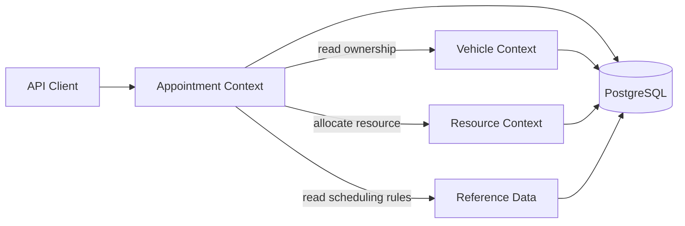
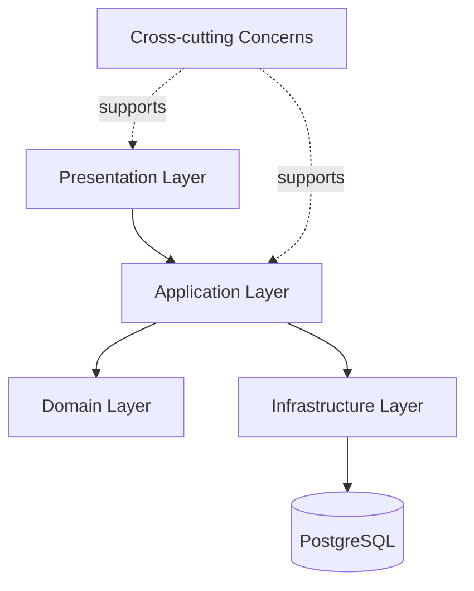
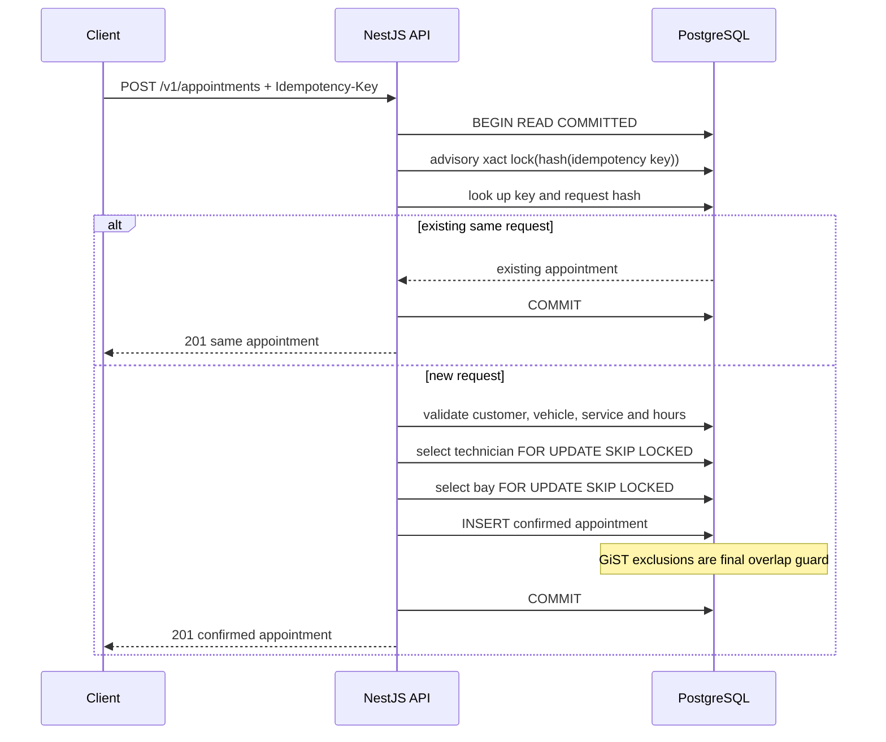
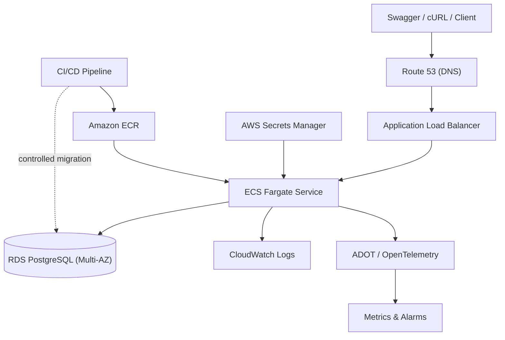

# Scenario A System Design

## Executive summary

The Unified Service Scheduler confirms a vehicle-service appointment only when one qualified technician and one compatible service bay are available for the entire service duration. The implementation is a stateless NestJS modular monolith backed by PostgreSQL. It optimizes first for a correct booking invariant and then for operational simplicity.

Scenario A gives no traffic or contention figures. This design therefore assumes low-to-medium contention within a physical dealership: aggregate traffic may grow across dealerships, but the collision domain is normally one dealership, resource, and time period. Short database transactions, row-level coordination, and database exclusion constraints fit that profile without introducing a distributed queue or lock service.

## Assumptions and scope

1. One appointment requires exactly one customer, vehicle, service type, dealership, technician, and service bay.
2. A service type owns the duration and required bay type. The server calculates `endsAt` and snapshots the duration on the appointment.
3. A technician must own every skill required by the service type and have a shift containing the complete requested period.
4. The bay and technician must belong to the requested dealership and must have no overlapping unavailability.
5. Dealership weekly business hours are interpreted in the dealership's IANA timezone.
6. Availability is a read-time snapshot. Only successful booking creates a commitment.
7. `CONFIRMED` and `IN_PROGRESS` appointments consume resources; `COMPLETED` and `CANCELLED` appointments do not.
8. API timestamps must include `Z` or an explicit UTC offset.
9. The service runs as a single writer against PostgreSQL. Multi-region active-active writes are out of scope.
10. Authentication and resource administration are production integration points, not features silently assumed to exist in this assessment.

Non-goals are temporary holds, waitlists, payment, notifications, recurring appointments, multi-stage workshop jobs, event sourcing, Kubernetes, and a user interface beyond Swagger/cURL.

## Domain boundaries



### Appointment context

Owns appointment lifecycle, availability checks, atomic allocation, idempotency, and cancellation. Its public use cases are check availability, book, retrieve, and cancel. It references other contexts but does not mutate their tables.

### Vehicle context

Owns customers, vehicles, VIN identity, and customer-vehicle ownership. A composite database relationship ensures an appointment cannot bind a vehicle to the wrong customer.

### Resource context

Owns technicians, skills, shifts, unavailability, service bays, bay types, and bay unavailability. It exposes allocation-oriented reads to Appointment. Technician and bay selection are independent predicates joined by the appointment transaction.

### Reference-data context

Owns dealership identity/timezone/business hours and service-type duration, bay type, and skill requirements. Appointment snapshots the duration so later catalog changes cannot rewrite appointment history.

This is domain-driven separation inside one deployable unit. Modules share a database for transactional integrity, but ownership remains explicit and avoids eager, cross-domain object graphs.

## Software architecture

The implementation uses Clean Architecture-light rather than a ceremonial framework:



Commands that change state (`book`, `cancel`) and the availability query are visibly separate operations, but there is no event bus or duplicate CQRS read model. The smallest useful boundaries are retained:

- Controllers validate transport input and expose the HTTP contract.
- Application services orchestrate policies and transaction scope.
- Domain types name lifecycle and business outcomes.
- Repositories/raw parameterized SQL express PostgreSQL-specific allocation rules.
- Explicit migrations, with `synchronize: false`, own schema evolution.

This structure can be split later at context boundaries, while keeping the present deployment and debugging model simple.

## Data model and invariants

The main tables are:

- `dealerships` and `dealership_business_hours`.
- `customers` and `vehicles`.
- `service_types`, `skills`, and `service_type_required_skills`.
- `technicians`, `technician_skills`, `technician_shifts`, and `technician_unavailability`.
- `service_bays` and `service_bay_unavailability`.
- `appointments`.

Important database guarantees include unique VIN and idempotency key, positive service duration, valid lifecycle values, `ends_at > starts_at`, and composite foreign keys that bind vehicle/customer and resource/dealership correctly.

Appointment stores `starts_at` and `ends_at` as `timestamptz`. PostgreSQL generates this column:

```sql
tstzrange(starts_at, ends_at, '[)')
```

The half-open `[start, end)` interval lets an appointment ending at 10:00 coexist with another starting at 10:00. `tstzrange` represents instants correctly across dealership timezones and daylight-saving transitions; local business hours are converted using the dealership IANA timezone before persistence.

After enabling `btree_gist`, two partial GiST exclusion constraints reject overlapping active appointments for:

- the same `(dealership_id, technician_id)`; and
- the same `(dealership_id, service_bay_id)`.

The partial predicate applies only to `CONFIRMED` and `IN_PROGRESS`, so cancellation releases a slot without deleting audit history. PostgreSQL SQLSTATE `23P01` from either named constraint becomes a stable `409 SLOT_CONFLICT` response.

## Availability flow

`POST /v1/availability/check` performs a non-locking read:

1. Validate UUIDs and an offset-aware future timestamp.
2. Load the active dealership, timezone, service duration, bay type, and business hours.
3. Calculate the end time on the server.
4. Verify the whole range is inside dealership business hours.
5. Find a technician who has all required skills, a containing shift, no blockout, and no active appointment overlap.
6. Find an active compatible bay with no blockout or active appointment overlap.
7. Return an availability snapshot and calculated period, or a reason code.

The response is intentionally not a reservation. A caller must handle a later booking conflict because another transaction may commit after this read.

## Atomic booking and concurrency control



The layers serve different purposes:

- The transaction-scoped advisory lock serializes concurrent retries of the same idempotency key. It is not a slot lock and does not globally serialize bookings.
- A SHA-256 request hash distinguishes a safe replay from reuse of the key with a different payload.
- Technician is always locked before bay. `FOR UPDATE ... SKIP LOCKED` avoids waiting on a resource another allocator is already considering and reduces deadlock risk.
- Application overlap predicates improve allocation quality and return useful domain errors.
- Exclusion constraints are the final authority. They still protect data if another API instance or future code path races past an earlier availability read.

Cancellation uses its own short transaction and locks the appointment row. Repeating cancellation after the first commit returns the already-cancelled appointment. The database predicate then allows the released resources to be booked again.

## Failure design

| Failure                                      | Behavior                                                                                                              |
| -------------------------------------------- | --------------------------------------------------------------------------------------------------------------------- |
| Concurrent requests target one resource pair | Only the available capacity commits; other requests receive a conflict.                                               |
| Client times out after commit                | Retrying the same payload/key returns the same appointment.                                                           |
| API task exits before commit                 | PostgreSQL rolls back its open transaction and releases locks.                                                        |
| Two different application instances race     | Row locks coordinate normal allocation; exclusion constraints preserve the invariant.                                 |
| Deadlock or transient database failover      | The transaction fails atomically; clients may retry with the same idempotency key. Unbounded server retry is avoided. |
| Database cannot be reached                   | Readiness fails while liveness can remain healthy, preventing new traffic without forcing restart loops.              |
| Telemetry collector is unavailable           | Booking continues; trace export is optional and shutdown does not block on the collector.                             |
| Service duration changes                     | Existing appointments retain the stored duration snapshot.                                                            |

Restore capability is part of the production design: RDS automated backups, point-in-time recovery, and periodically exercised restore procedures. Database migrations should run once as a controlled deployment step, not from every horizontally scaled task.

## Target cloud architecture

The repository implements local Docker Compose deployment. The following is the target production topology, not a claim of an existing AWS deployment:



- ALB is the public edge and terminates TLS.
- ECS tasks and RDS live in private subnets. The RDS security group accepts database traffic only from the ECS task security group.
- Tasks are stateless and can scale horizontally using CPU, memory, request count, and latency signals.
- PostgreSQL remains the consistency boundary and single writer; Multi-AZ improves availability without weakening booking reads through replication lag.
- Secrets are injected at runtime and never built into the image.
- `DATABASE_SSL` is disabled only for local Compose. Production sets it to `true` and ships/trusts the current RDS CA chain so certificate verification remains enabled.
- Graceful shutdown drains requests during rolling deployments.

## Observability

The request path is observable from ingress to database:

- **Logs:** `nestjs-pino` emits structured logs with service, environment, request ID, trace ID, route, status, and error code. Incoming safe `x-request-id` values are propagated; unsafe values are replaced. Authorization, cookies, API keys, and selected customer PII paths are redacted.
- **Metrics:** `/metrics` exposes Prometheus-format HTTP totals, active requests, latency histograms, and prefixed Node.js process metrics. Production alerts should cover error rate, p95/p99 latency, readiness, saturation, connection usage, lock waits, deadlocks, and exclusion-conflict rate.
- **Tracing:** OpenTelemetry Node auto-instrumentation is optional through `OTEL_ENABLED=true`; traces export with OTLP/HTTP and can follow a booking request through NestJS and PostgreSQL.
- **Health:** `/health/live` checks process progress; `/health/ready` performs a bounded database ping. These signals have different deployment meanings and are kept separate.
- **Errors:** Validation and domain failures have stable codes plus request/trace identifiers. Unexpected exception details remain in server logs instead of leaking to clients.

Metrics labels use normalized route templates, not resource IDs, to avoid high-cardinality telemetry.

## Security and threat assumptions

The assessment has no identity provider, so its endpoints must not be exposed to the public internet as-is. The production design places OIDC/Cognito authentication at or before the API and uses dealership-scoped authorization for all reads and writes.

| Threat                                         | Current mitigation                                                        | Production follow-up                                                                        |
| ---------------------------------------------- | ------------------------------------------------------------------------- | ------------------------------------------------------------------------------------------- |
| Spoofed or replayed booking                    | UUID idempotency key, payload hash, transaction-scoped serialization      | Authenticate caller; scope idempotency to tenant/client; retention policy.                  |
| Cross-customer or cross-dealership association | DTO validation and composite database foreign keys                        | Tenant claims and authorization policy on every query.                                      |
| Injection                                      | Parameterized SQL and strict DTO allowlisting                             | Dependency/SAST scanning and database least privilege.                                      |
| PII leakage                                    | Structured-log redaction and generic 5xx responses                        | Data classification, retention, encryption-key and access audits.                           |
| Denial of service                              | Rate limiting, bounded connection pool, short transactions, health checks | WAF, per-identity quotas, load tests, alarms, capacity runbooks.                            |
| Secret disclosure                              | `.env` ignored; no credentials in the image                               | Secrets Manager rotation and task-role least privilege.                                     |
| Tampering with schedules/resources             | No public mutation endpoints exist                                        | Authenticated admin workflow, audit trail, optimistic versioning, and safe conflict checks. |

TLS is required in production. RDS encryption at rest, encrypted backups, restricted security groups, a non-owner application database role, dependency/image scanning, and patch management belong in the deployment baseline.

## Scale, cache, independence, and automation

### Scale safely first

The API is stateless, queries are scoped by dealership and indexed, transactions are short, and each task's database pool is capped. Scale ECS tasks horizontally while monitoring the aggregate RDS connection budget. Add RDS Proxy only when measurements show connection churn or connection limits are a bottleneck. Reporting may use a read replica, but booking and authoritative availability must read the writer.

If a single database later becomes a bottleneck, `dealership_id` is a natural partition/shard key because booking conflicts do not cross dealerships. This is an evolution path, not an MVP dependency.

### Cache only non-authoritative data

Service catalog, dealership metadata, business hours, and stable skill/bay configuration can later use short-TTL caches with explicit invalidation. Technician/bay availability, overlap results, and booking outcomes must not use a cache as their source of truth. A stale availability cache would trade correctness for speed at precisely the wrong boundary.

### Keep context ownership independent

Modules own their tables and expose narrow application operations. If Resource or Appointment needs independent deployment later, first replace direct in-process reads with explicit contracts while retaining one transactional owner for resource allocation. Notifications, CRM synchronization, and analytics can be emitted after commit through a transactional outbox and SQS; the queue should not decide whether a booking is valid.

### Automate repeatable work

Docker Compose standardizes local PostgreSQL, runs migration as a one-shot service before API startup, and supports a repeatable seed for demo data. CI runs installation, migration, seed, lint, typecheck, all test layers, build, and OpenAPI generation. A production pipeline should add image/SBOM scanning, one-at-a-time migration execution, deployment health checks, rollback controls, and restore drills.

## Current limitation: seed-only resource mutation

The implementation has no HTTP commands for technicians, skills, shifts, bay maintenance, business hours, customers, vehicles, or service types. Those records are migration/seed-managed. This is intentional for Scenario A: it keeps the attack surface and scope small, but it is not a complete dealership administration system.

Before adding public mutation APIs, define:

- authenticated dealership administrators and tenant scoping;
- audit history and actor attribution;
- optimistic concurrency/versioning;
- behavior when a shift or bay blockout conflicts with confirmed appointments;
- validation of timezone and recurring schedule rules;
- import/idempotency contracts for upstream dealer-management systems.

Evolution should be triggered by a real integration or operational need, not by speculative CRUD completeness.

## Trade-offs and evolution triggers

| Current decision                    | Benefit                                         | Cost                             | Trigger to evolve                                                                 |
| ----------------------------------- | ----------------------------------------------- | -------------------------------- | --------------------------------------------------------------------------------- |
| Modular monolith                    | One transaction and simple deployment/debugging | Components share release cadence | Distinct teams, materially different scale, or compliance boundary.               |
| PostgreSQL coordination             | Strong invariant with few moving parts          | Writer/lock capacity is finite   | Measured lock waits, connection pressure, or dealership-hotspot SLO breach.       |
| Synchronous confirmation            | Clear client result at commit                   | Client waits for database path   | Long-running workflow requiring a hold/saga; keep final allocation transactional. |
| No queue in booking                 | No partition-ordering/retry subsystem           | No asynchronous buffering        | Add outbox/SQS for post-commit side effects, not slot correctness.                |
| No authoritative availability cache | Correct reads from the consistency boundary     | More database reads              | Precompute suggestions only if search load is measured; booking still rechecks.   |
| Single-region writer                | Simple temporal consistency                     | Regional outage exposure         | Proven recovery objectives justify a carefully designed failover strategy.        |

The governing rule is reliability before throughput optimization: measure latency, lock waits, conflicts, connection use, and dealership hotspots; then change only the constrained component.

## Decision records

- [ADR 0001: Use a modular monolith](adr/0001-modular-monolith.md)
- [ADR 0002: Use database locking rather than a message queue](adr/0002-database-locking-over-message-queue.md)
- [ADR 0003: Use `tstzrange` and exclusion constraints](adr/0003-tstzrange-exclusion-constraints.md)
